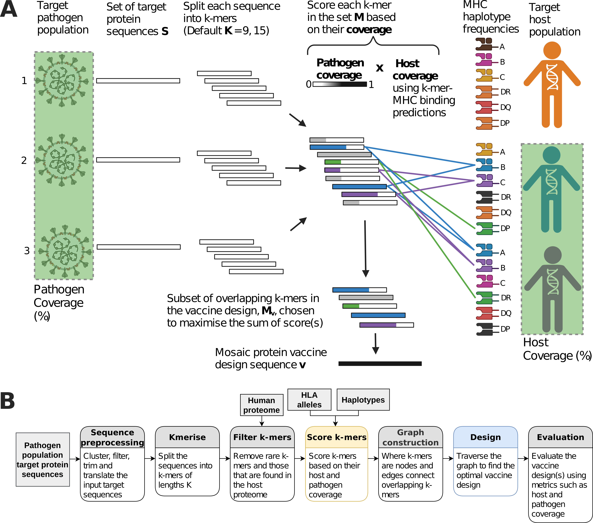

# Spectravax

A computational method to design broad-spectrum T-cell-inducing vaccines that account for genetic diversity in both the host and pathogen populations.

[](https://www.biorxiv.org/content/10.1101/2025.04.14.648815v1)
[](https://opensource.org/licenses/MIT)

## Overview

Spectravax scores pathogen protein k-mers using two coverage metrics — **pathogen coverage** (fraction of pathogen variants containing a k-mer) and **host coverage** (fraction of the host population predicted to present vaccine-derived peptides via their HLA alleles) — then uses a graph-based algorithm to select the optimal overlapping k-mers that form a contiguous vaccine antigen maximising total coverage.

We applied Spectravax to design a betacoronavirus nucleocapsid antigen. In silico and experimental (mouse) validation showed it elicited robust immune responses to SARS-CoV, SARS-CoV-2, and MERS-CoV, outperforming wild-type sequences and existing computational designs.

## The Spectravax Framework

<p align="center">
  
</p>

**A)** Overview of the Spectravax vaccine design aiming to maximise coverage of host and pathogen populations. Pathogen coverage is shown as the fraction of pathogen variants (green highlighted viruses) containing peptides in the vaccine design. Host coverage is represented by the fraction of individuals (green highlighted figures) predicted to present vaccine-derived peptides via their HLA alleles. **B)** Spectravax computational workflow: sequence preprocessing, k-mer generation, filtering, scoring, graph construction, vaccine design, and evaluation.

## Installation

### Prerequisites

- [Conda](https://docs.conda.io/en/latest/) or [Mamba](https://mamba.readthedocs.io/)
- [NetMHCpan 4.2](https://services.healthtech.dtu.dk/services/NetMHCpan-4.2/) — MHC-I binding predictions (requires academic license from DTU)
- [NetMHCIIpan 4.3](https://services.healthtech.dtu.dk/services/NetMHCIIpan-4.3/) — MHC-II binding predictions (requires academic license from DTU)
- [CD-HIT](http://weizhong-lab.ucsd.edu/cd-hit/) — sequence clustering

### Setup

```bash
# Clone the repository
git clone https://github.com/PhilPalmer/Spectravax.git && cd Spectravax

# Create and activate the conda environment
conda env create --name spectravax --file environment.yml
conda activate spectravax
```

## Quick Start

### 1. Test your installation

A test FASTA file is included in `examples/`. To quickly verify everything is working, run the pipeline with pathogen coverage scoring only (no external tools or reference data required):

```bash
python -m tvax design \
  --fasta examples/test_input.fasta \
  --skip-host-coverage \
  --results-dir results \
  --output results/vaccine.fasta
```

### 2. Run the full pipeline with host coverage

The full pipeline additionally scores k-mers for MHC-I/II host coverage, which requires [NetMHCpan](https://services.healthtech.dtu.dk/services/NetMHCpan-4.1/) and [NetMHCIIpan](https://services.healthtech.dtu.dk/services/NetMHCIIpan-4.0/), as well as reference data files (HLA allele lists, haplotype frequencies, and optionally the human proteome for filtering out self-peptides).

First, download the reference data:

```bash
python -m tvax download-data --data-dir data
```

Then run the full pipeline:

```bash
python -m tvax design \
  --fasta examples/test_input.fasta \
  --data-dir data \
  --results-dir results \
  --k 9 --k 15 \
  --output results/vaccine.fasta
```

On the test input (10 sequences, 20 AAs each), the full pipeline took ~6 minutes on a MacBook Air. The MHC binding step uses [Redun](https://github.com/insitro/redun) to parallelise predictions and produces verbose console output, so you may want to run it in a terminal multiplexer like `tmux` or `screen`.

```bash
# See all options
python -m tvax design --help
```

### Python API

```python
from tvax.config import EpitopeGraphConfig
from tvax.graph import build_epitope_graph
from tvax.design import design_vaccines
from tvax.seq import path_to_seq

config = EpitopeGraphConfig(
    fasta_path="examples/test_input.fasta",
    mhc1_alleles_path="spectravax_data/mhc1_alleles.txt",
    mhc2_alleles_path="spectravax_data/mhc2_alleles.txt",
    hap_freq_mhc1_path="spectravax_data/hap_freq_mhc1.pkl",
    hap_freq_mhc2_path="spectravax_data/hap_freq_mhc2.pkl",
    k=[9, 15],
)

G = build_epitope_graph(config)
designs = design_vaccines(G, config)
vaccine_seq = path_to_seq(designs[0])
print(vaccine_seq)
```

## Project Structure

```
Spectravax/
├── tvax/                        Core Python package
│   ├── __main__.py              CLI entry point (python -m tvax)
│   ├── config.py                Configuration (EpitopeGraphConfig)
│   ├── seq.py                   Sequence preprocessing, k-merisation, MSA
│   ├── score.py                 Epitope scoring (conservation, MHC binding, population coverage)
│   ├── graph.py                 Directed k-mer graph construction and decycling
│   ├── design.py                Graph-based optimisation and cocktail design
│   ├── eval.py                  Evaluation metrics (host and pathogen coverage)
│   ├── analyse.py               Analysis pipeline for paper figures
│   ├── plot.py                  Visualisation functions
│   ├── pca_protein_rank.py      PCA-based clade assignment
│   └── netmhcpan_workflow.py    NetMHCpan / NetMHCIIpan integration via Redun
├── assets/                      Figures/images
│   └── fig2_spectravax_framework.png
├── examples/                    Example input files
│   └── test_input.fasta         Test FASTA (10 sequences, 20 AAs each)
├── environment.yml              Conda environment specification
├── requirements.txt             Python package dependencies
├── LICENSE                      MIT license
└── README.md                    This file
```

## Citation

If you use Spectravax in your research, please cite:

> Palmer, P., et al. (2025).
> Covering All Bases: A Computational Method to Design Broad-Spectrum
> T-cell-Inducing Vaccines Applied to Betacoronaviruses.
> *bioRxiv*, 2025.04.14.648815.
> [https://doi.org/10.1101/2025.04.14.648815](https://doi.org/10.1101/2025.04.14.648815)

## License

This project is licensed under the [MIT License](LICENSE).
